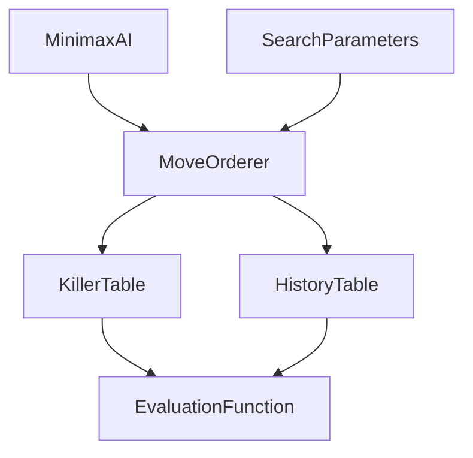

# v0.7.0 - AI算法优化版

|||||
|---|---|---|---|
|**版本**|v0.7.0 (AI优化版)|
|**计划日期**|2026年2月下旬 - 3月初|
|**预计周期**|2周 (10-15工作日)|
|**参考项目**|Egaroucid, edax-reversi, Reversi(Java)|
|**代码量**|~1,000行|
|**优先级**|P3 - 高级优化功能|

---

## 1. 项目背景与学术对齐

### 1.1 学术背景

**对应Reversi_Proposal.md章节**:
- **Desirable Priority 3**: Advanced Move Ordering
- **8.2 Algorithm Optimisation**: Killer Heuristic, History Heuristic

### 1.2 参考项目分析

| 参考项目 | 优先级 | 借鉴内容 | 参考文件 |
|---------|--------|---------|---------|
| **Egaroucid** | ⭐⭐⭐⭐⭐ | Killer/History权重参数、走法排序 | `src/engine/move_ordering.hpp`, `src/engine/search.hpp` |
| **edax-reversi** | ⭐⭐⭐⭐ | History数组实现、走法排序 | `src/play.c` |
| **Reversi(Java)** | ⭐⭐⭐ | Minimax实现参考 | `src/player/ai/Minimax.java` |

### 1.3 详细参考代码

#### Egaroucid move_ordering.hpp (关键权重参数)

**项目位置**: `OtherProjects/Egaroucid/src/engine/move_ordering.hpp`

```cpp
// 中局搜索权重 (Midgame)
constexpr int W_KILLER = 8;
constexpr int W_HISTORY_MOVE = 6;
constexpr int W_COUNTER_MOVE = 3;
constexpr int W_MOBILITY = 35;
constexpr int W_POTENTIAL_MOBILITY = 17;
constexpr int W_TT_BONUS = 485;
constexpr int W_VALUE = 269;

// 残局搜索权重 (Endgame)
constexpr int W_NWS_KILLER = 5;
constexpr int W_NWS_HISTORY_MOVE = 3;
constexpr int W_NWS_COUNTER_MOVE = 1;
constexpr int W_NWS_MOBILITY = 17;
constexpr int W_NWS_TT_BONUS = 7;
constexpr int W_NWS_VALUE = 204;

// 简单残局权重
constexpr int W_END_NWS_MOBILITY = 40;
constexpr int W_END_NWS_VALUE = 12;
constexpr int W_END_NWS_SIMPLE_MOBILITY = 18;
constexpr int W_END_NWS_SIMPLE_PARITY = 17;
constexpr int W_END_NWS_SIMPLE_TT_BONUS = 300;
```

#### edax-reversi play.c (History实现)

**项目位置**: `OtherProjects/edax-reversi/src/play.c`

```c
// History数组: 记录走法历史得分
char history[64];
memset(history, 0, 64);

// 更新history: 每次导致剪枝时增加得分
if (A1 <= x && x <= H8) history[x] = ++j;

// 使用: 在走法生成时优先选择history值高的走法
```

### 1.4 参考文件详细路径

| 功能 | 参考项目 | 详细路径 |
|------|---------|---------|
| Killer/History权重参数 | Egaroucid | `src/engine/move_ordering.hpp` (第79-120行) |
| 走法排序函数 | Egaroucid | `src/engine/search.hpp` |
| History数组实现 | edax-reversi | `src/play.c` (第999-1065行) |
| Minimax实现 | Reversi(Java) | `src/player/ai/Minimax.java` |

---

## 2. 功能需求

### 2.1 核心功能 (P3)

#### 2.1.1 Killer Moves (杀手走法)

**功能描述**: 记录在搜索树中导致Beta剪枝的走法，在相同深度搜索时优先尝试这些走法

**参考实现** (Egaroucid):

```cpp
// Killer Move 结构
struct KillerMove {
    int move;           // 走法
    int depth;          // 搜索深度
    int score;          // 杀手系数
};

// Killer Table: 每个深度存储2个最佳走法
class KillerTable {
private:
    static constexpr int MAX_KILLER_COUNT = 2;
    static constexpr int MAX_DEPTH = 64;
    
    KillerMove killers_[MAX_DEPTH][MAX_KILLER_COUNT];
    
public:
    // 添加杀手走法
    void addKiller(int depth, int move, int score);
    
    // 获取深度d的杀手走法
    std::vector<int> getKillers(int depth) const;
    
    // 清空表
    void clear();
    
    // 判断是否为杀手走法
    bool isKiller(int depth, int move) const;
};
```

**实现要点**:
- 每个深度维护2个最佳杀手走法
- 使用计数机制避免同一走法重复添加
- 深度迭代时保留上一层的杀手信息

#### 2.1.2 History Heuristic (历史启发)

**功能描述**: 记录每个走法在历史上导致剪枝的次数，用于全局走法排序

**参考实现** (Egaroucid):

```cpp
// History Table: 64x64 走法历史矩阵
class HistoryTable {
private:
    static constexpr int NUM_SQUARES = 64;
    
    // history_[from][to] = 从from到to的走法历史得分
    int history_[NUM_SQUARES][NUM_SQUARES];
    
public:
    // 增加走法历史得分
    void addHistory(int from, int to, int depth);
    
    // 获取走法历史得分
    int getHistoryScore(int from, int to) const;
    
    // 获取排序后的走法列表
    std::vector<int> getSortedMoves(const std::vector<int>& moves) const;
    
    // 清空历史表
    void clear();
    
    // 衰减历史得分 (防止历史数据过时)
    void decay(double factor = 0.99);
};
```

**实现要点**:
- 64x64 矩阵存储所有可能的走法
- 每次Beta剪枝时增加历史得分
- 搜索前进行衰减处理
- 结合位置和目标格进行索引

#### 2.1.3 整合走法排序器

**功能描述**: 统一管理所有走法排序策略

```cpp
// MoveOrderer: 综合多种排序策略
class MoveOrderer {
private:
    KillerTable killerTable_;
    HistoryTable historyTable_;
    
    // 评估函数引用
    const EvaluationFunction& eval_;
    
public:
    // 主排序函数
    std::vector<int> orderMoves(const Board& board, 
                                int depth,
                                const std::vector<int>& moves,
                                int ply);
    
    // 静态评估排序 (快速走法排序)
    std::vector<int> orderMovesByStatic(const Board& board,
                                        const std::vector<int>& moves);
    
    // 添加杀手走法
    void addKiller(int depth, int move);
    
    // 添加历史得分
    void addHistory(int from, int to, int depth);
    
    // 清空所有排序数据
    void clear();
    
    // 获取统计数据
    struct Statistics {
        int killerHits;
        int historyHits;
        int moveCount;
    };
    Statistics getStatistics() const;
};
```

**排序优先级**:
1. **PV走法** (Principal Variation) - 已知最佳走法
2. **杀手走法** - 历史导致剪枝的走法
3. **历史启发** - 历史得分高的走法
4. **静态评估** - 评估函数得分
5. **其他** - 按原始顺序

### 2.2 优化功能 (P3)

#### 2.2.1 搜索参数调优

**功能描述**: 基于Killer/History信息调整搜索参数

```cpp
// SearchParameters: 动态搜索参数
struct SearchParameters {
    // Killer/History系数
    double killerWeight = 1.0;
    double historyWeight = 0.5;
    
    // 深度调整
    int extensionThreshold = 4;   // 扩展阈值
    int reductionThreshold = 10;  // 减少阈值
    
    // 时间控制
    int timeMargin = 100;         // 时间缓冲(ms)
    
    // 验证方法
    void loadFromConfig(const QString& configPath);
    void saveToConfig(const QString& configPath) const;
};
```

### 2.3 验收标准

| 功能 | 验收条件 | 测试方法 |
|------|---------|---------|
| Killer Moves | 添加/获取正常工作 | 单元测试 |
| History Heuristic | 矩阵正确更新 | 单元测试 |
| 走法排序 | PV > Killer > History > Static | 集成测试 |
| 搜索效率 | 相同深度搜索节点数减少 ≥10% | 对比测试 |
| 胜率提升 | Minimax-6 vs Random 胜率 ≥92% | Head-to-head |

---

## 3. 技术设计

### 3.1 目录结构

```
src/ai/
├── MoveOrderer.h           [新增] 走法排序器
├── MoveOrderer.cpp
├── KillerTable.h          [新增] 杀手走法表
├── KillerTable.cpp
├── HistoryTable.h         [新增] 历史启发表
├── HistoryTable.cpp
├── SearchParameters.h     [新增] 搜索参数
├── SearchParameters.cpp
└── (修改) MinimaxAI.cpp   - 集成走法排序
```

### 3.2 依赖关系



### 3.3 关键算法

#### Killer Moves 添加算法

```cpp
void KillerTable::addKiller(int depth, int move, int score) {
    // 检查是否已存在
    for (int i = 0; i < MAX_KILLER_COUNT; ++i) {
        if (killers_[depth][i].move == move) {
            killers_[depth][i].score += score;
            return;
        }
    }
    
    // 找到最低分数位置
    int minIdx = 0;
    int minScore = killers_[depth][0].score;
    for (int i = 1; i < MAX_KILLER_COUNT; ++i) {
        if (killers_[depth][i].score < minScore) {
            minScore = killers_[depth][i].score;
            minIdx = i;
        }
    }
    
    // 替换
    if (score > minScore) {
        killers_[depth][minIdx] = {move, depth, score};
    }
}
```

#### History Heuristic 更新算法

```cpp
void HistoryTable::addHistory(int from, int to, int depth) {
    // 深度加权：越深的搜索历史越重要
    int weight = depth * depth;
    history_[from][to] += weight;
    
    // 防止溢出
    if (history_[from][to] > 1000000) {
        decay(0.5);  // 严重溢出时减半
    }
}
```

---

## 4. 性能目标

### 4.1 算法性能

| 指标 | 当前基线 | v0.7.0目标 | 提升 |
|------|---------|-----------|------|
| Minimax-6 搜索节点数 | X | ≤X*0.9 | ≥10% |
| Alpha-Beta剪枝效率 | Y | ≥Y*1.1 | ≥10% |
| Killer命中率 | - | ≥15% | - |
| History命中率 | - | ≥20% | - |

### 4.2 游戏性能

| 指标 | 目标 | 测试方法 |
|------|------|---------|
| Minimax-6 vs Random | ≥92%胜率 | 100局 |
| Minimax-8 vs Minimax-6 | ≥55%胜率 | 50局 |
| 平均思考时间 | ≤5秒 | 100次测量 |

---

## 5. 测试计划

### 5.1 单元测试

| 测试项 | 测试用例 |
|--------|---------|
| KillerTable | 添加、获取、清空、深度边界 |
| HistoryTable | 添加、获取、清空、衰减 |
| MoveOrderer | 排序优先级、统计正确性 |

### 5.2 集成测试

| 测试项 | 测试用例 |
|--------|---------|
| MinimaxAI集成 | Killer/History正确传递 |
| 搜索效率 | 节点数对比 |
| 游戏质量 | 胜率测试 |

### 5.3 性能测试

| 测试项 | 测试用例 |
|--------|---------|
| 搜索速度 | 相同位置不同深度 |
| 内存占用 | 表大小测量 |
| 稳定性 | 长时间运行无崩溃 |

---

## 6. 时间规划

```
v0.7.0 开发周期 (2周)
│
├── Week 1
│   ├── Day 1-2: KillerTable 实现
│   ├── Day 3-4: HistoryTable 实现
│   ├── Day 5: MoveOrderer 整合
│   └── Day 6-7: 单元测试
│
└── Week 2
    ├── Day 8-9: MinimaxAI 集成
    ├── Day 10: 集成测试
    ├── Day 11: 性能验证
    └── Day 12: 文档和代码清理
```

---

## 7. 风险评估

| 风险 | 影响 | 缓解措施 |
|------|------|---------|
| Killer表内存溢出 | 中 | 使用固定大小+计数机制 |
| History表查找开销 | 低 | 使用数组直接索引 |
| 排序反而降低效率 | 中 | 添加开关选项 |
| 与现有代码冲突 | 中 | 完整单元测试验证 |

---

**版本状态**: 设计完成，准备开发

**预计完成时间**: 2026年3月初

**前置依赖**: v0.6.0 (研究框架版)
