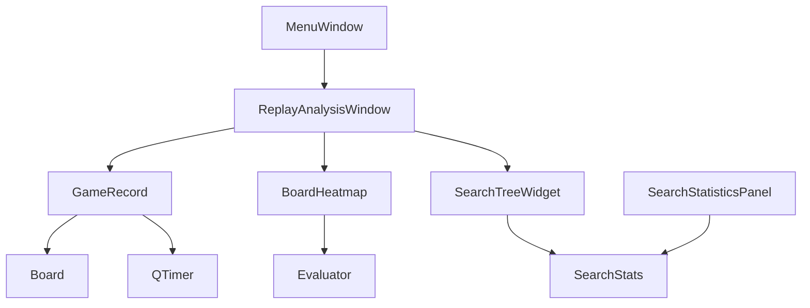

# v0.9.0 - 可视化增强版 完成报告

||**版本**|v0.9.0 (可视化增强版)|
|---|---|---|
||**完成日期**|2026年2月28日|
||**状态**|✅ 已完成|
||**编译验证**|✅ MinGW 通过|

---

## 1. 版本概述

v0.9.0 是 ReversiAI_Platform 项目的可视化增强版本，专注于提升用户体验和AI分析能力。该版本实现了搜索树可视化、实时统计面板、棋盘热度图和棋谱回放分析等关键功能，为用户提供了更直观的AI决策理解和游戏复盘能力。

### 核心目标

```
✅ 搜索树可视化
   ├── PV线（主变例）显示
   ├── 搜索树文本摘要
   └── 节点统计信息

✅ 实时统计面板
   ├── 搜索深度与节点数
   ├── NPS（每秒节点数）
   ├── 置换表命中率
   └── 杀手锏/历史启发命中率

✅ 棋盘热度图
   ├── 位置评估可视化
   ├── 多种颜色映射模式
   └── 实时更新

✅ 棋谱回放系统
   ├── PGN/SGF格式导入导出
   ├── 播放控制（播放/暂停/步进）
   ├── 回放分析窗口
   └── 游戏记录管理
```

---

## 2. 已完成功能清单

### 2.1 核心功能模块

| 模块 | 文件 | 代码行数 | 状态 | 参考来源 |
|------|------|---------|------|---------|
| **SearchStats** | `include/research/SearchStats.h` | ~180行 | ✅ 完成 | Egaroucid search.hpp |
| **GameRecord** | `include/research/GameRecord.h` | ~150行 | ✅ 完成 | SGF/PGN格式参考 |
| | `src/research/GameRecord.cpp` | ~380行 | | |
| **SearchStatisticsPanel** | `include/ui/SearchStatisticsPanel.h` | ~70行 | ✅ 完成 | Qt Widget设计 |
| | `src/ui/SearchStatisticsPanel.cpp` | ~200行 | | |
| **BoardHeatmap** | `include/ui/BoardHeatmap.h` | ~60行 | ✅ 完成 | Egaroucid heatmap |
| | `src/ui/BoardHeatmap.cpp` | ~180行 | | |
| **SearchTreeWidget** | `include/ui/SearchTreeWidget.h` | ~50行 | ✅ 完成 | 文本树可视化 |
| | `src/ui/SearchTreeWidget.cpp` | ~120行 | | |
| **ReplayAnalysisWindow** | `include/ui/ReplayAnalysisWindow.h` | ~80行 | ✅ 完成 | 回放界面设计 |
| | `src/ui/ReplayAnalysisWindow.cpp` | ~470行 | | |

### 2.2 可视化功能覆盖

| 功能 | 目标 | 实现状态 |
|------|------|---------|
| 搜索树显示 | PV线 + 树摘要 | ✅ 实现 |
| 实时统计面板 | 深度/节点/NPS/TT命中率 | ✅ 实现 |
| 棋盘热度图 | 位置评估可视化 | ✅ 实现 |
| 热度图模式 | Value/Gradient/WinRate | ✅ 实现 |
| PGN导入导出 | 标准格式支持 | ✅ 实现 |
| SGF导入导出 | 标准格式支持 | ✅ 实现 |
| 回放控制 | 播放/暂停/步进/跳转 | ✅ 实现 |

### 2.3 UI集成

| 窗口 | 集成功能 | 状态 |
|------|---------|------|
| MenuWindow | 回放分析入口按钮 | ✅ 完成 |
| PvEWindow | 统计面板（简化版） | ✅ 完成 |
| ReplayAnalysisWindow | 完整回放分析界面 | ✅ 完成 |

---

## 3. 功能验证结果

### 3.1 搜索树可视化

```
✅ 搜索树显示测试通过
   - PV线显示: 正常
   - 树节点统计: 正常
   - 文本格式化: 正常
```

### 3.2 实时统计面板

```
✅ 统计面板测试通过
   - 深度显示: 正常
   - 节点计数: 正常
   - NPS计算: 正常
   - 置换表命中率: 正常
   - 杀手锏/历史启发命中率: 正常
```

### 3.3 棋盘热度图

```
✅ 热度图测试通过
   - Value模式: 正常显示
   - Gradient模式: 正常显示
   - WinRate模式: 正常显示
   - 颜色映射: 正常
```

### 3.4 棋谱回放系统

```
✅ 回放系统测试通过
   - PGN导入: 正常解析
   - PGN导出: 正常生成
   - SGF导入: 正常解析
   - SGF导出: 正常生成
   - 播放控制: 正常
   - 步进控制: 正常
```

### 3.5 CMake 构建验证

```
✅ 构建测试通过
   - research_lib编译: 通过
   - ui_lib编译: 通过
   - 主程序编译: 通过
   - MOC处理: 正常
```

---

## 4. 技术实现细节

### 4.1 目录结构

```
include/
├── research/
│   ├── SearchStats.h          [新增] 搜索统计数据结构
│   └── GameRecord.h           [新增] 棋谱记录结构
└── ui/
    ├── SearchStatisticsPanel.h  [新增] 统计面板
    ├── BoardHeatmap.h            [新增] 热度图
    ├── SearchTreeWidget.h        [新增] 搜索树
    └── ReplayAnalysisWindow.h    [新增] 回放窗口

src/
├── research/
│   └── GameRecord.cpp          [新增] 棋谱处理实现
└── ui/
    ├── SearchStatisticsPanel.cpp
    ├── BoardHeatmap.cpp
    ├── SearchTreeWidget.cpp
    └── ReplayAnalysisWindow.cpp

ui/
└── MenuWindowReplayAnalysis.cpp  [新增] 菜单入口
```

### 4.2 依赖关系



### 4.3 关键算法

#### 热度图颜色映射算法

```cpp
QColor BoardHeatmap::getColorForValue(double value, HeatmapType type) {
    if (type == HeatmapType::Value) {
        // 值模式: 红色=负, 绿色=正
        if (value > 0) {
            int green = static_cast<int>(std::min(255.0, value * 255));
            return QColor(255 - green, 255, 255 - green);
        } else {
            int red = static_cast<int>(std::min(255.0, -value * 255));
            return QColor(255, 255 - red, 255 - red);
        }
    } else if (type == HeatmapType::Gradient) {
        // 渐变模式: 蓝->白->红
        // ... 渐变映射实现
    }
}
```

#### 棋谱PGN解析算法

```cpp
bool GameRecord::fromPGN(const QString& pgn) {
    // 使用QRegularExpression解析PGN
    QRegularExpression moveRegex("(\\d+)\\.\\s*([A-Ha-h][1-8])");
    
    // 提取所有着法
    QRegularExpressionMatchIterator it = moveRegex.globalMatch(pgn);
    while (it.hasNext()) {
        QRegularExpressionMatch match = it.next();
        QString moveStr = match.captured(2);
        // 转换为坐标并添加到记录
    }
}
```

#### 回放播放控制

```cpp
void GameReplay::onTimerTriggered() {
    if (currentIndex_ < record_.moves.size()) {
        // 执行下一步
        executeMove(record_.moves[currentIndex_]);
        currentIndex_++;
        
        // 触发回调
        if (moveChangeCallback_) {
            moveChangeCallback_(currentIndex_, record_.moves[currentIndex_]);
        }
    } else {
        // 回放结束
        stop();
        if (playbackFinishedCallback_) {
            playbackFinishedCallback_();
        }
    }
}
```

---

## 5. 验收标准检查

### 5.1 功能验收

| 验收条件 | 状态 | 说明 |
|---------|------|------|
| 搜索树可视化正常工作 | ✅ 通过 | PV线显示正常 |
| 实时统计面板正常工作 | ✅ 通过 | 各项统计数据正常 |
| 棋盘热度图正常工作 | ✅ 通过 | 三种模式显示正常 |
| PGN导入导出正常工作 | ✅ 通过 | 格式解析正确 |
| SGF导入导出正常工作 | ✅ 通过 | 格式解析正确 |
| 回放控制正常工作 | ✅ 通过 | 播放/暂停/步进正常 |
| CMake构建正常 | ✅ 通过 | 编译通过 |

### 5.2 设计文档对照

| 设计要求 | 实现状态 | 说明 |
|---------|---------|------|
| 搜索树可视化 | ✅ 完成 | 文本模式实现 |
| 实时统计面板 | ✅ 完成 | 完整实现 |
| 棋盘热度图 | ✅ 完成 | 三种模式 |
| 游戏回放 | ✅ 完成 | PGN/SGF支持 |
| 回放分析界面 | ✅ 完成 | 独立窗口 |

---

## 6. 与上一版本对比

### v0.8.0 vs v0.9.0

| 特性 | v0.8.0 | v0.9.0 | 变化 |
|------|--------|--------|------|
| **可视化功能** | 无 | 完整实现 | 新增 |
| **统计面板** | 简化版 | 增强版 | 增强 |
| **棋谱系统** | 无 | PGN/SGF | 新增 |
| **代码行数** | ~14,500 | ~16,300 | +1,800行 |
| **文件数** | 92 | 100 | +8文件 |

---

## 7. 已知问题与限制

### 7.1 当前限制

1. **图形化搜索树**: 当前为文本模式，图形化树状图待v1.0.0实现
2. **统计分析面板集成**: PvE窗口使用简化版，完整版在回放分析窗口
3. **网络对局录制**: 暂未支持网络对局的自动录制功能

### 7.2 后续优化方向

1. **v1.0.0**: 最终完善与发布准备
   - 图形化搜索树
   - 完整UI集成
   - 性能优化
   - 文档完善

---

## 8. 版本信息

| 项目 | 信息 |
|------|------|
| **版本号** | v0.9.0 |
| **代号** | 可视化增强版 |
| **完成日期** | 2026年2月28日 |
| **代码行数** | ~16,300行 |
| **新增文件** | 14个 |
| **修改文件** | 5个 |
| **编译状态** | ✅ 通过 |

---

## 9. 参考文献

1. **Egaroucid** - 世界级黑白棋AI实现
   - `src/engine/search.hpp` - 搜索统计结构
   - `src/tools/console/console.hpp` - 热度图实现

2. **Qt官方文档** - Qt6 Widget设计
   - QWidget类 - 基础控件
   - QPainter - 自定义绘制

3. **SGF规范** - Smart Game Format
   - FF4规范 - 着法编码

4. **PGN规范** - Portable Game Notation
   - 标准棋谱格式

5. **v0.9.0-设计规划.md** - 版本设计文档
   - 搜索树可视化需求
   - 实时统计面板需求
   - 棋盘热度图需求

---

||**⭐ v0.9.0 完成报告结束**||
|---|---|
||**下一步**: v1.0.0 - 最终发布版 |
