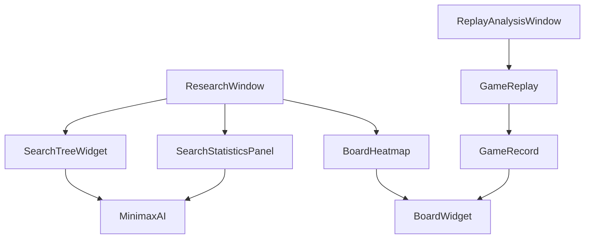

# v0.9.0 - 可视化增强版

|||||
|---|---|---|---|
|**版本**|v0.9.0 (可视化增强版)|
|**计划日期**|2026年3月下旬|
|**预计周期**|1-2周 (5-10工作日)|
|**参考项目**|QtReversi, MCTS-AI-Reversi, Egaroucid|
|**代码量**|~500行|
|**优先级**|P5 - 可选增强功能|

---

## 1. 项目背景与功能定位

### 1.1 功能定位

**对应Reversi_Proposal.md章节**:
- **Desirable Priority 5**: Extended Visualisation
- 搜索树可视化、图表分析

**版本定位**:
- 这是一个**可选增强版本**
- 如果时间充足则实现
- 如果时间紧张可以跳过，直接进入v1.0.0

### 1.2 参考项目分析

| 参考项目 | 优先级 | 借鉴内容 | 参考文件 |
|---------|--------|---------|---------|
| **QtReversi** | ⭐⭐⭐⭐⭐ | Qt界面实现、棋盘绘制 | `代码/chess/widget.cpp` |
| **MCTS-AI-Reversi** | ⭐⭐⭐⭐⭐ | MCTS树结构、可视化 | `C++ QT/wbchessQT/MCTS.cpp` |
| **Egaroucid** | ⭐⭐⭐⭐ | 搜索树GUI、图表渲染 | `src/gui/` |

### 1.3 详细参考代码

#### MCTS-AI-Reversi MCTS树结构

**项目位置**: `OtherProjects/MCTS-AI-Reversi/C++ QT/wbchessQT/MCTS.cpp`

```cpp
class MCTS {
public:
    vector<MCTS*> child;          // 子节点
    MCTS* parent;                 // 父节点
    int visit_count;              // 访问次数
    double win_rate;              // 胜率
    int move;                     // 当前走法
    
    // UCT计算
    double uctValue(int parentVisit) {
        if (visit_count == 0) return INFINITY;
        double exploitation = win_rate / visit_count;
        double exploration = sqrt(log(parentVisit) / visit_count);
        return exploitation + 1.41 * exploration;
    }
    
    // 选择最佳子节点
    MCTS* selectChild() {
        MCTS* best = nullptr;
        double bestValue = -INFINITY;
        for (auto c : child) {
            double val = c->uctValue(visit_count);
            if (val > bestValue) {
                bestValue = val;
                best = c;
            }
        }
        return best;
    }
};

typedef struct ResultNode {
    MCTS* state;
    int tile;
    ResultNode(MCTS* state, int tile) {
        this->state = state;
        this->tile = tile;
    }
}Result;
```

#### QtReversi 棋盘绘制

**项目位置**: `OtherProjects/QtReversi/代码/chess/widget.cpp`

```cpp
void Widget::paintEvent(QPaintEvent *event) {
    QPainter painter(this);
    painter.setRenderHint(QPainter::Antialiasing);
    
    // 绘制棋盘背景
    for(int i=0; i<8; i++) {
        for(int j=0; j<8; j++) {
            QRectF rect(i*size, j*size, size, size);
            painter.fillRect(rect, (i+j)%2==0 ? Qt::darkGreen : Qt::white);
            painter.drawRect(rect);
        }
    }
    
    // 绘制棋子
    for(int i=0; i<64; i++) {
        if(board[i] != EMPTY) {
            drawChessman(painter, i, board[i]);
        }
    }
}

void Widget::drawChessman(QPainter &painter, int index, int color) {
    int x = index % 8;
    int y = index / 8;
    QPoint center(x*size + size/2, y*size + size/2);
    QRadialGradient gradient(center, size/2 - 2);
    
    if(color == BLACK) {
        gradient.setColorAt(0, Qt::black);
        gradient.setColorAt(1, Qt::darkGray);
    } else {
        gradient.setColorAt(0, Qt::white);
        gradient.setColorAt(1, Qt::lightGray);
    }
    
    painter.setBrush(gradient);
    painter.drawEllipse(center, size/2-4, size/2-4);
}
```

### 1.4 参考文件详细路径

| 功能 | 参考项目 | 详细路径 |
|------|---------|---------|
| Qt界面框架 | QtReversi | `代码/chess/widget.cpp` |
| 棋盘绘制 | QtReversi | `代码/chess/widget.cpp` |
| MCTS树结构 | MCTS-AI-Reversi | `C++ QT/wbchessQT/MCTS.cpp` |
| 搜索树可视化 | Egaroucid | `src/gui/` |
| GUI组件 | Egaroucid | `src/gui/` |

---

## 2. 功能需求

### 2.1 搜索过程可视化 (P5)

#### 2.1.1 搜索树可视化

**功能描述**: 在AI思考时实时显示搜索树的深度、节点数、分支情况

```cpp
// ui/SearchTreeWidget.h

#pragma once

#include <QWidget>
#include <QPainter>
#include <QVector>
#include <QPair>

namespace Reversi {

// 搜索树节点
struct SearchTreeNode {
    int move;                 // 走法
    int depth;                // 深度
    double value;             // 评估值
    int nodeCount;            // 子节点数
    bool isPV;                // 是否为PV路线
    QVector<SearchTreeNode*> children;
    SearchTreeNode* parent;
    
    // 位置信息 (用于绘制)
    QPoint position;
};

// 搜索树可视化部件
class SearchTreeWidget : public QWidget {
    Q_OBJECT

public:
    explicit SearchTreeWidget(QWidget* parent = nullptr);
    
    // 更新搜索树数据
    void updateSearchTree(const SearchTreeNode* root);
    
    // 清空显示
    void clear();
    
    // 设置显示参数
    void setMaxDepth(int depth);
    void setNodeRadius(int radius);
    void setShowPVOnly(bool pvOnly);
    
    // 导出图片
    void exportToImage(const QString& filepath);
    
signals:
    void nodeClicked(const SearchTreeNode* node);

protected:
    void paintEvent(QPaintEvent* event) override;
    void mousePressEvent(QMouseEvent* event) override;

private:
    void calculateLayout(const SearchTreeNode* node, int& x, int y, int level);
    void drawNode(QPainter& painter, const SearchTreeNode* node);
    void drawEdge(QPainter& painter, const SearchTreeNode* parent, const SearchTreeNode* child);
    
    const SearchTreeNode* root_;
    int maxDisplayDepth_;
    int nodeRadius_;
    bool showPVOnly_;
    int nodeIdCounter_;
};

} // namespace Reversi
```

#### 2.1.2 实时统计面板

**功能描述**: 显示AI搜索的实时统计数据

```cpp
// ui/SearchStatisticsPanel.h

#pragma once

#include <QWidget>
#include <QLabel>
#include <QProgressBar>
#include <QVBoxLayout>

namespace Reversi {

class SearchStatisticsPanel : public QWidget {
    Q_OBJECT

public:
    explicit SearchStatisticsPanel(QWidget* parent = nullptr);
    
    // 更新统计数据
    void updateStatistics(const SearchStats& stats);
    
    // 清空显示
    void clear();
    
private slots:
    void updateDisplay();
    
private:
    void setupUI();
    void createStatRow(const QString& label, QLabel*& valueLabel);
    
    // 统计显示
    QLabel* depthLabel_;
    QLabel* nodesLabel_;
    QLabel* npsLabel_;           // Nodes per second
    QLabel* timeLabel_;
    QLabel* ttHitRateLabel_;     // 转置表命中率
    QLabel* killerHitLabel_;     // 杀手走法命中
    QLabel* hashFullLabel_;      // 哈希表填充率
    
    // 进度条
    QProgressBar* searchProgress_;
    
    // 实时数据
    SearchStats currentStats_;
};

} // namespace Reversi
```

**显示内容**:
| 指标 | 描述 |
|------|------|
| Depth | 当前搜索深度 |
| Nodes | 已搜索节点数 |
| NPS | 每秒搜索节点数 |
| Time | 已用时间 |
| TTHit% | 转置表命中率 |
| Killer% | 杀手走法命中率 |
| Hash% | 哈希表填充率 |

### 2.2 棋盘热度图 (P5)

#### 2.2.1 位置价值热度图

**功能描述**: 用颜色深浅显示各位置的价值/重要性

```cpp
// ui/BoardHeatmap.h

#pragma once

#include <QWidget>
#include "ui/BoardWidget.h"

namespace Reversi {

class BoardHeatmap : public QWidget {
    Q_OBJECT

public:
    enum class HeatmapType {
        PositionValue,     // 位置价值
        VisitCount,        // 访问次数
        WinRate,           // 胜率
        ActionValue        // 动作价值
    };
    
    explicit BoardHeatmap(QWidget* parent = nullptr);
    
    // 设置热度数据 (64个格子的值)
    void setHeatmapData(const QVector<double>& values, HeatmapType type);
    
    // 清除热度数据
    void clearHeatmap();
    
    // 设置透明度
    void setHeatmapOpacity(double opacity);
    
    // 叠加到棋盘显示
    void applyToBoard(BoardWidget* board);

private:
    void paintEvent(QPaintEvent* event) override;
    QColor getHeatColor(double value);
    
    QVector<double> heatmapData_;
    HeatmapType currentType_;
    double opacity_;
    static const double HEATMAP_MIN = 0.0;
    static const double HEATMAP_MAX = 1.0;
};

} // namespace Reversi
```

**热度图类型**:
| 类型 | 说明 | 颜色映射 |
|------|------|---------|
| PositionValue | 静态位置价值 | 蓝(低)→红(高) |
| VisitCount | MCTS访问次数 | 白(低)→深蓝(高) |
| WinRate | 胜率 | 红(0%)→黄(50%)→绿(100%) |
| ActionValue | 动作评估值 | 蓝(低)→红(高) |

### 2.3 对局复盘功能 (P5)

#### 2.3.1 棋谱记录与回放

**功能描述**: 记录并回放完整对局

```cpp
// core/GameRecord.h

#pragma once

#include <QVector>
#include <QString>
#include <QJsonObject>
#include <QDateTime>

namespace Reversi {

// 单步记录
struct MoveRecord {
    int move;                  // 走法 (0-63)
    int player;                // 玩家 (0=黑, 1=白)
    int discCountBlack;        // 黑子数
    int discCountWhite;        // 白子数
    double aiEvaluation;        // AI评估值
    int searchDepth;           // 搜索深度
    int64_t nodesSearched;     // 搜索节点数
    double thinkingTime;      // 思考时间(ms)
    QDateTime timestamp;       // 时间戳
};

// 完整对局记录
struct GameRecord {
    QString recordId;          // 记录ID
    QDateTime startTime;       // 开始时间
    QDateTime endTime;         // 结束时间
    
    QString player1Type;       // 玩家1类型 (Human/AI)
    QString player1Name;        // 玩家1名称
    QString player2Type;       // 玩家2类型
    QString player2Name;       // 玩家2名称
    
    int winner;                // 胜者 (0=黑, 1=白, 2=平)
    int finalBlack;            // 最终黑子数
    int finalWhite;            // 最终白子数
    
    QVector<MoveRecord> moves; // 走法序列
    
    // 导出方法
    QJsonObject toJson() const;
    static GameRecord fromJson(const QJsonObject& json);
    QString toPGN() const;      // 导出为PGN格式
    QString toSGF() const;      // 导出为SGF格式
};

// 复盘控制器
class GameReplay : public QObject {
    Q_OBJECT

public:
    explicit GameReplay(QObject* parent = nullptr);
    
    // 加载对局记录
    bool loadRecord(const GameRecord& record);
    
    // 播放控制
    void play();
    void pause();
    void stop();
    void stepForward();
    void stepBackward();
    void jumpToMove(int moveIndex);
    void setPlaybackSpeed(double speed);
    
    // 获取当前状态
    int getCurrentMoveIndex() const;
    const MoveRecord& getCurrentMove() const;
    const Board& getCurrentBoard() const;
    
signals:
    void boardUpdated(const Board& board);
    void moveChanged(int moveIndex, const MoveRecord& move);
    void playbackFinished();

private:
    GameRecord record_;
    Board currentBoard_;
    int currentMoveIndex_;
    bool isPlaying_;
    double playbackSpeed_;
    QTimer* playbackTimer_;
};

} // namespace Reversi
```

#### 2.3.2 复盘分析界面

```cpp
// ui/ReplayAnalysisWindow.h

#pragma once

#include <QMainWindow>
#include "core/GameRecord.h"
#include "ui/BoardWidget.h"

namespace Reversi {

class ReplayAnalysisWindow : public QMainWindow {
    Q_OBJECT

public:
    explicit ReplayAnalysisWindow(QWidget* parent = nullptr);
    ~ReplayAnalysisWindow() override;
    
    // 加载对局文件
    bool loadGameFile(const QString& filepath);
    
    // 加载对局记录
    void loadRecord(const GameRecord& record);

private slots:
    void onOpenFile();
    void onExportPGN();
    void onExportSGF();
    void onPlaybackSpeedChanged(int value);
    
private:
    void setupUI();
    void setupConnections();
    void updateDisplay();
    
    // UI部件
    BoardWidget* boardWidget_;
    QSlider* playbackSlider_;
    QLabel* moveInfoLabel_;
    QLabel* progressLabel_;
    QComboBox* speedComboBox_;
    
    // 复盘控制
    GameReplay replay_;
    GameRecord currentRecord_;
};

} // namespace Reversi
```

---

## 3. 技术设计

### 3.1 目录结构

```
src/ui/
├── (新增) searchtreewidget.h      # 搜索树可视化
├── (新增) searchstatisticspanel.h # 实时统计面板
├── (新增) boardheatmap.h          # 棋盘热度图
├── (新增) gamerecord.h            # 对局记录
├── (新增) replayanalysiswindow.h  # 复盘分析窗口
└── (修改) researchwindow.cpp       # 集成新可视化
```

### 3.2 依赖关系



---

## 4. 验收标准

### 4.1 搜索可视化

| 功能 | 验收条件 |
|------|---------|
| 搜索树显示 | 能显示至少10层深度 |
| 节点渲染 | 清晰区分PV/非PV节点 |
| 实时更新 | 每秒更新不少于5次 |
| 节点点击 | 能显示节点详细信息 |

### 4.2 热度图

| 功能 | 验收条件 |
|------|---------|
| 颜色映射 | 正确显示冷暖色 |
| 透明度 | 可调整，不遮挡棋盘 |
| 数据类型 | 支持4种类型切换 |

### 4.3 复盘功能

| 功能 | 验收条件 |
|------|---------|
| 文件加载 | 支持JSON/PGN/SGF格式 |
| 播放控制 | 支持播放/暂停/步进/跳转 |
| 速度调节 | 支持0.25x-4x速度 |
| 导出功能 | 正确导出为标准格式 |

---

## 5. 时间规划

```
v0.9.0 开发周期 (1-2周，可选)
│
├── 方案A: 完整实现 (2周)
│   ├── Day 1-2: 搜索树可视化
│   ├── Day 3: 统计面板
│   ├── Day 4: 热度图
│   ├── Day 5-6: 复盘功能
│   └── Day 7: 测试+整合
│
└── 方案B: 精简实现 (1周)
    ├── Day 1-2: 搜索树可视化
    ├── Day 3: 统计面板
    └── Day 4-5: 集成+测试
```

---

## 6. 风险评估

| 风险 | 影响 | 缓解措施 |
|------|------|---------|
| 渲染性能 | 中 | 限制最大节点数 |
| 内存占用 | 中 | 定期清理历史数据 |
| 功能冲突 | 低 | 模块化设计 |
| 时间不足 | 高 | 可选，跳过此版本 |

---

## 7. 跳过策略

如果时间紧张，可以**跳过v0.9.0直接进入v1.0.0**，因为：

1. **P5是可选功能** - 不是Essential/Desirable P1-P2
2. **不影响毕业核心要求** - 已有足够实验数据
3. **可后续添加** - 不影响系统核心功能

---

**版本状态**: 设计完成

**预计完成时间**: 2026年3月下旬 (可选)

**前置依赖**: v0.8.0 (性能验证版)

**后续**: v1.0.0 (最终版)
