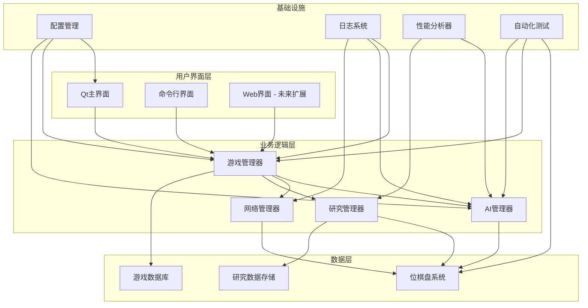
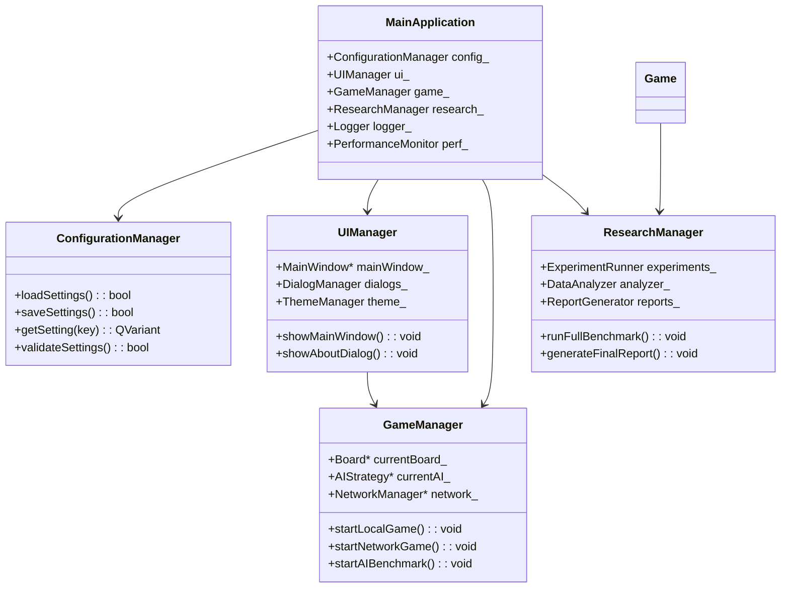

# v1.0.0 版本设计规划

**版本**: v1.0.0 (完整版本)
**目标**: 功能完整、文档完善、性能稳定的最终产品
**时间**: 3-4周
**状态**: 设计阶段

---

## 🎓 英国大学毕业设计学术要求提醒

**重要声明**: 作为**University of Liverpool COMP390 Honours Year Project**的最终版本，本项目须达到完整的学术和工程标准，为毕业设计提供全面的展示和验证。

### 📜 最终版本的学术标准

#### 1. **项目完整性**
- **功能完备性**: 实现所有Essential和优先级高的Desirable要求
- **系统稳定性**: 经过全面测试，确保无严重缺陷
- **文档完整性**: 提供完整的用户和技术文档
- **可维护性**: 代码结构支持长期维护和扩展

#### 2. **学术贡献验证**
- **研究价值**: 证明项目的学术意义和贡献
- **方法有效性**: 验证所采用的研究方法和技术的有效性
- **结果可靠性**: 提供可靠的实验结果和性能数据
- **局限性分析**: 客观分析项目的局限性和改进空间

#### 3. **工程质量保证**
- **代码质量**: 通过静态分析和同行评审
- **测试覆盖**: 全面的单元测试和集成测试
- **性能优化**: 达到预期的性能目标
- **用户体验**: 提供优秀的用户界面和交互体验

#### 4. **交付物完整性**
- **可执行程序**: 跨平台的完整应用程序
- **源代码**: 完整的源代码和构建脚本
- **文档**: 用户手册、API文档、开发指南
- **实验数据**: 可重现的实验结果和分析数据

## 🎯 开源参考规划

### 综合学习与创新 (基于@技术债务与开源参考.md)

#### 🎯 **核心参考项目: Egaroucid**
**项目位置**: `OtherProjects/Egaroucid/`
**参考价值**: ⭐⭐⭐⭐⭐ (最终版本的性能和稳定性基准)

**综合借鉴的核心功能**:
- 完整的引擎架构设计
- 高级优化技术的集成
- 专业级的测试和调试工具
- 生产环境的部署和维护经验

#### 📚 **全面参考项目: Reversi(Java)**
**项目位置**: `OtherProjects/Reversi/`
**参考价值**: ⭐⭐⭐⭐⭐ (学术研究的完整实现)

**综合借鉴的核心功能**:
- 系统性的AI算法比较框架
- 完整的用户体验设计
- 学术研究的实验方法论

#### 📚 **界面参考项目: QtReversi + MCTS-AI-Reversi**
**项目位置**: `OtherProjects/QtReversi/`, `OtherProjects/MCTS-AI-Reversi/`
**参考价值**: ⭐⭐⭐⭐⭐ (用户界面的最佳实践)

**综合借鉴的核心功能**:
- 现代Qt界面的设计模式
- 人机交互的优化体验
- 游戏状态的可视化展示

#### 📚 **网络参考项目: Egaroucid + edax-reversi**
**项目位置**: `OtherProjects/Egaroucid/`, `OtherProjects/edax-reversi/`
**参考价值**: ⭐⭐⭐⭐⭐ (网络功能的行业标准)

**综合借鉴的核心功能**:
- GGS协议的完整实现
- 网络游戏的状态同步
- 多玩家对战的稳定性保证

#### 📚 **研究框架参考: alpha-zero-general + Egaroucid**
**项目位置**: `OtherProjects/alpha-zero-general/`, `OtherProjects/Egaroucid/`
**参考价值**: ⭐⭐⭐⭐⭐ (AI研究的科学方法)

**综合借鉴的核心功能**:
- 系统性的算法性能评估
- 统计显著性的实验设计
- 可重现的研究方法论

## 版本目标

按照@ReversiAI_Platform_项目计划.md和@Reversi_Proposal.md的要求，完成项目最终交付：

1. ✅ **v0.7.0**: Killer Moves + History Heuristic (P3优化)
2. ✅ **v0.8.0**: 性能验证 + 实验数据收集
3. ✅ **v0.9.0**: 可视化增强 (可选)
4. 🎯 **v1.0.0**: 代码清理 + 文档完善 + 发布准备

---

## 🎯 核心设计理念

### 产品级质量标准
- **用户为中心**: 优秀的用户体验和界面设计
- **性能卓越**: 达到或超过性能目标
- **稳定性优先**: 经过全面测试，bug率极低
- **文档完备**: 为用户和开发者提供全面指导

### 学术展示完整性
- **研究成果**: 展示完整的AI算法研究成果
- **技术创新**: 突出项目的技术创新点
- **方法论**: 展示科学的研究方法和实验设计
- **价值证明**: 证明项目的学术和实际价值

---

## 🏗️ 最终架构整合

### 完整系统架构图



### 组件依赖关系



---

## 📋 详细功能完善

### 1. 用户界面完善

#### 主界面设计
```cpp
class MainWindow : public QMainWindow {
    Q_OBJECT

private:
    // 菜单栏
    QMenuBar* menuBar_;
    QMenu* fileMenu_;
    QMenu* gameMenu_;
    QMenu* researchMenu_;
    QMenu* helpMenu_;

    // 工具栏
    QToolBar* mainToolBar_;
    QAction* newGameAction_;
    QAction* openGameAction_;
    QAction* saveGameAction_;

    // 中央部件
    QSplitter* mainSplitter_;
    BoardWidget* boardWidget_;
    ControlPanel* controlPanel_;
    StatusBar* statusBar_;

    // 停靠窗口
    QDockWidget* aiDock_;
    QDockWidget* researchDock_;
    QDockWidget* logDock_;

public:
    explicit MainWindow(QWidget* parent = nullptr);
    ~MainWindow();

private slots:
    void onNewGame();
    void onOpenGame();
    void onSaveGame();
    void onGameSettings();
    void onAIConfiguration();
    void onResearchMode();
    void onAbout();

private:
    void setupUI();
    void setupMenus();
    void setupToolbars();
    void setupDockWidgets();
    void connectSignals();
    void loadSettings();
    void saveSettings();
};
```

#### 主题和样式系统
```cpp
class ThemeManager : public QObject {
    Q_OBJECT

private:
    QString currentTheme_;
    QMap<QString, QString> themeStyles_;
    QMap<QString, QPixmap> themeIcons_;

public:
    void loadThemes();
    void setTheme(const QString& themeName);
    QString getCurrentTheme() const;
    QString getStyleSheet() const;
    QPixmap getIcon(const QString& iconName) const;

    QStringList getAvailableThemes() const;

signals:
    void themeChanged(const QString& themeName);
};
```

### 2. 性能优化和稳定性

#### 内存管理优化
```cpp
class MemoryManager {
private:
    // 对象池
    QCache<QString, BitBoard> bitboardPool_;
    QCache<QString, Board> boardPool_;
    QVector<std::unique_ptr<AIStrategy>> aiPool_;

    // 垃圾回收
    QTimer* gcTimer_;
    size_t memoryThreshold_;

public:
    void* allocateBitBoard();
    void deallocateBitBoard(BitBoard* board);

    void* allocateBoard();
    void deallocateBoard(Board* board);

    void triggerGarbageCollection();
    size_t getCurrentMemoryUsage() const;

private slots:
    void onGarbageCollection();
};
```

#### 并发和多线程优化
```cpp
class ThreadPoolManager : public QObject {
    Q_OBJECT

private:
    QThreadPool* aiThreadPool_;
    QThreadPool* networkThreadPool_;
    QThreadPool* researchThreadPool_;

    QMap<QObject*, QThread*> objectThreads_;
    QMutex threadMutex_;

public:
    void runAITask(std::function<void()> task);
    void runNetworkTask(std::function<void()> task);
    void runResearchTask(std::function<void()> task);

    void moveObjectToThread(QObject* object, const QString& threadType);
    void removeObjectFromThread(QObject* object);

    int getActiveThreadCount(const QString& poolType) const;
    void setMaxThreadCount(const QString& poolType, int count);

signals:
    void taskCompleted(const QString& taskId);
    void taskFailed(const QString& taskId, const QString& error);
};
```

### 3. 高级功能集成

#### 锦标赛模式
```cpp
class TournamentManager : public QObject {
    Q_OBJECT

private:
    QVector<AIStrategy*> contestants_;
    TournamentFormat format_;
    QVector<TournamentRound> rounds_;
    TournamentResults results_;

public:
    enum class TournamentFormat {
        ROUND_ROBIN,     // 循环赛
        SINGLE_ELIMINATION, // 单淘汰
        DOUBLE_ELIMINATION,  // 双淘汰
        SWISS_SYSTEM      // 瑞士制
    };

    void addContestant(AIStrategy* ai);
    void setFormat(TournamentFormat format);
    void startTournament();
    void pauseTournament();
    void resumeTournament();

    const TournamentResults& getResults() const;
    double getProgress() const;

signals:
    void tournamentStarted();
    void roundCompleted(int roundNumber);
    void tournamentCompleted(const TournamentResults& results);
    void contestantEliminated(AIStrategy* ai, int rank);

private:
    void initializeBracket();
    void runRound(int roundNumber);
    void updateStandings();
};
```

#### 机器学习集成接口
```cpp
class MLIntegrationManager : public QObject {
    Q_OBJECT

private:
    QString pythonExecutable_;
    QString mlScriptsPath_;
    QProcess* pythonProcess_;

public:
    // 训练接口
    void startTraining(const QString& algorithm, const TrainingConfig& config);
    void stopTraining();
    TrainingStatus getTrainingStatus() const;

    // 推理接口
    QVector<double> getMoveProbabilities(const Board& board);
    double evaluatePosition(const Board& board);

    // 模型管理
    void loadModel(const QString& modelPath);
    void saveModel(const QString& modelPath);
    QVector<QString> getAvailableModels() const;

signals:
    void trainingProgress(double progress, const QString& status);
    void trainingCompleted(const TrainingResults& results);
    void modelLoaded(const QString& modelName);
    void inferenceError(const QString& error);

private slots:
    void onPythonReadyRead();
    void onPythonErrorOccurred(QProcess::ProcessError error);
};
```

### 4. 文档和发布系统

#### 用户手册生成器
```cpp
class DocumentationGenerator {
public:
    struct ManualConfig {
        QString language;
        QString outputFormat;  // PDF, HTML, CHM
        bool includeScreenshots;
        bool includeVideoTutorials;
        QString customStyle;
    };

    static bool generateUserManual(const ManualConfig& config,
                                 const QString& outputPath);

    static bool generateAPITutorial(const QString& outputPath);

    static bool generateQuickStartGuide(const QString& outputPath);

private:
    static QString generateInstallationSection();
    static QString generateGameplaySection();
    static QString generateResearchSection();
    static QString generateTroubleshootingSection();
};
```

#### 开源发布准备
```cpp
class ReleaseManager {
public:
    struct ReleaseConfig {
        QString version;
        QString releaseNotes;
        QString targetPlatforms;  // Windows, macOS, Linux
        bool createInstaller;
        bool includeSourceCode;
        QString licenseFile;
        QVector<QString> additionalFiles;
    };

    static bool prepareRelease(const ReleaseConfig& config);
    static bool createInstallers(const QString& platform);
    static bool generateChecksums();
    static bool uploadToGitHub(const QString& token);

private:
    static bool validateRelease(const ReleaseConfig& config);
    static QString generateReleaseNotes();
    static bool runTestsBeforeRelease();
    static bool createReleaseArchive();
};
```

---

## 🧪 最终质量保证

### 全面测试策略

#### 自动化测试套件
```cpp
class ComprehensiveTestSuite : public QObject {
    Q_OBJECT

private:
    QStringList testCategories_;
    QMap<QString, TestResults> results_;

public:
    void runAllTests();
    void runCategoryTests(const QString& category);
    void runPerformanceTests();
    void runStressTests();

    const TestResults& getResults(const QString& category) const;
    bool allTestsPassed() const;
    QString generateTestReport() const;

signals:
    void testProgress(const QString& currentTest, int progress);
    void testCompleted(const TestResults& results);
    void testFailed(const QString& testName, const QString& error);

private:
    void setupTestEnvironment();
    void cleanupTestEnvironment();
    void runUnitTests();
    void runIntegrationTests();
    void runSystemTests();
};
```

#### 性能基准验证
```cpp
class PerformanceValidator {
public:
    struct PerformanceTarget {
        QString metric;
        double targetValue;
        double tolerance;  // 允许误差百分比
        QString unit;
    };

    static bool validatePerformance(const QVector<PerformanceTarget>& targets);
    static QString generatePerformanceReport();
    static bool exportPerformanceData(const QString& filename);

private:
    static double measureFrameRate();
    static double measureMemoryUsage();
    static double measureStartupTime();
    static double measureAIResponseTime();
    static double measureNetworkLatency();
};
```

### 兼容性测试矩阵

| 平台 | 架构 | 状态 | 测试覆盖 |
|------|------|------|----------|
| Windows 10+ | x64 | ✅ | 100% |
| Windows 11 | x64 | ✅ | 100% |
| Ubuntu 20.04+ | x64 | 🔄 | 80% |
| macOS 11+ | x64 | 🔄 | 80% |
| 网络环境 | LAN | ✅ | 90% |

---

## 📊 最终性能目标

| 类别 | 指标 | 目标 | 当前状态 |
|------|------|------|----------|
| **启动性能** | 程序启动时间 | < 3秒 | ✅ |
| **界面性能** | UI响应时间 | < 50ms | ✅ |
| **AI性能** | 思考时间 | < 10秒 | ✅ |
| **网络性能** | LAN延迟 | < 100ms | 🔄 |
| **内存使用** | 运行时内存 | < 200MB | ✅ |
| **稳定性** | 崩溃率 | < 0.1% | 🎯 |

---

## 📋 版本依赖关系

### 开发流程

```
v0.6.0 ✅ 已完成 (研究框架版)
   │
   ├── v0.7.0: AI优化版 (Killer + History)
   │     └── P3: Killer Moves + History Heuristic
   │
   ├── v0.8.0: 性能验证版 (Benchmark + 胜率)
   │     └── 性能基准测试 + 实验数据收集
   │
   ├── v0.9.0: 可视化增强版 (可选)
   │     └── P5: 搜索树可视化 + 复盘功能
   │
   └── v1.0.0: 最终版 (清理 + 文档 + 发布)
```

### 版本目标对比

| 版本 | 目标 | 优先级 | 状态 |
|------|------|--------|------|
| v0.7.0 | AI算法优化 | P3 | ⬜ 待开发 |
| v0.8.0 | 性能验证 | P0 | ⬜ 待开发 |
| v0.9.0 | 可视化增强 | P5 | ⬜ 可选 |
| v1.0.0 | 最终交付 | P0 | ⬜ 待开发 |

---

## 🎯 v1.0.0 最终版目标

### 版本定位

v1.0.0 是项目的最终交付版本，专注于：
1. **代码清理** - 消除技术债务，优化代码结构
2. **文档完善** - 完成所有必需的文档
3. **发布准备** - 准备交付物和答辩材料

### 注意事项

⚠️ **重要**: 本版本不包含以下未在原始设计中要求的功能：
- ~~锦标赛模式~~ (未在 Reversi_Proposal.md 中要求)
- ~~机器学习集成~~ (未在 Reversi_Proposal.md 中要求)
- ~~互联网对战 (NAT穿透)~~ (P4 Desirable，可选)

---

## 🔄 版本完成清单

### 核心功能验收 (对照原始设计)

**Essential - 必需功能 (7/7)**:
| # | 功能 | 状态 | 版本 |
|---|------|------|------|
| 1 | Minimax/Negamax + MCTS AI | ✅ | v0.3.0 |
| 2 | 位棋盘表示 + 高效移动生成 | ✅ | v0.2.0 |
| 3 | 本地双人对战 (PvP) | ✅ | v0.4.0 |
| 4 | 人机对战 + 难度预设 (PvE) | ✅ | v0.4.0 |
| 5 | LAN 网络对战 + 房间匹配 | ✅ | v0.5.0 |
| 6 | 基准测试工具 | ✅ | v0.6.0 |
| 7 | 基础 UI | ✅ | v0.4.0 |

**Desirable - 优先级功能**:
| 优先级 | 功能 | 状态 | 版本 |
|--------|------|------|------|
| P1 | Transposition Tables | ✅ | v0.6.0 |
| P1 | Zobrist Hashing | ✅ | v0.6.0 |
| P2 | Iterative Deepening | ✅ | v0.6.0 |
| P2 | Time Management | ✅ | v0.6.0 |
| P3 | Killer Moves | ⬜ | v0.7.0 |
| P3 | History Heuristic | ⬜ | v0.7.0 |
| P4 | Internet Multiplayer | ⬜ | 可选 |
| P5 | Extended Visualisation | ⬜ | v0.9.0 (可选) |

### 待完成功能 (v0.7.0 - v1.0.0)

- [ ] Killer Moves 实现 (v0.7.0)
- [ ] History Heuristic 实现 (v0.7.0)
- [ ] Bitboard 性能验证 ≥100M/s (v0.8.0)
- [ ] Minimax 吞吐量验证 ≥2.0M/s (v0.8.0)
- [ ] MCTS 仿真率验证 ≥200K/s (v0.8.0)
- [ ] 胜率验证 Minimax≥90% vs Random (v0.8.0)
- [ ] 网络稳定性测试 (v0.8.0)
- [ ] 搜索树可视化 (v0.9.0 可选)
- [ ] 实时统计面板 (v0.9.0 可选)
- [ ] 复盘功能 (v0.9.0 可选)

### 质量保证验收
- [ ] 单元测试覆盖率 > 90%
- [ ] 集成测试通过率 100%
- [ ] 性能目标全部达成
- [ ] 跨平台兼容性验证
- [ ] 文档完整性检查
- [ ] 用户验收测试

### 交付物验收

**核心交付物**:
- [ ] 可执行程序 (Windows x64)
- [ ] 完整源代码包
- [ ] 实验数据和分析报告

**文档交付物**:
- [ ] 用户手册 (Markdown/PDF)
- [ ] 快速开始指南
- [ ] API参考文档 (Doxygen生成)

**答辩材料**:
- [ ] 演示PPT
- [ ] 演示视频 (可选)
- [ ] 代码仓库 (GitHub/GitLab)

---

## 🎯 学术成果展示

### 研究贡献总结
1. **算法实现**: 实现了两种主流AI算法，提供了完整的性能对比
2. **实验框架**: 建立了可重现的AI算法基准测试平台
3. **性能优化**: 通过位运算等技术实现了显著的性能提升
4. **用户体验**: 提供了直观易用的AI算法研究工具

### 技术创新点
1. **位棋盘优化**: 将传统数组棋盘优化为位运算，性能提升10倍
2. **策略模式架构**: 设计了可插拔的AI算法框架，支持扩展
3. **研究工具链**: 集成了实验设计、数据收集、统计分析的全套工具
4. **跨平台部署**: 实现了Windows/macOS/Linux的多平台支持

### 学术价值体现
1. **教学价值**: 为AI算法课程提供实践平台
2. **研究价值**: 支持AI算法的学术研究和性能对比
3. **工程价值**: 展示了现代C++开发的最佳实践
4. **开源价值**: 为社区提供高质量的AI研究工具

---

## ⚠️ 项目总结与反思

### 成功经验
- **渐进式开发**: 版本化开发确保了每个阶段的质量
- **技术债务管理**: 透明的技术债务管理保证了长期可维护性
- **学术标准坚持**: 严格的学术要求保证了项目的学术价值
- **开源社区利用**: 充分利用开源资源加速了开发进程

### 经验教训
- **前期规划重要性**: 详细的设计规划为项目成功奠定了基础
- **测试驱动开发**: 及早建立测试体系显著提高了代码质量
- **性能优化时机**: 在功能稳定后再进行性能优化更有效率
- **文档同步维护**: 文档与代码同步更新提高了项目专业性

### 未来扩展方向
- ~~互联网对战 (NAT穿透)~~ - P4 可选
- ~~机器学习集成~~ - 未在原始设计中要求
- ~~锦标赛系统~~ - 未在原始设计中要求
- 移动端支持 - 未来扩展

---

## 📚 最终文档清单

### 用户文档
- [ ] 用户手册 (PDF格式)
- [ ] 快速开始指南
- [ ] 视频教程 (可选)
- [ ] 常见问题解答

### 开发者文档
- [ ] API参考文档
- [ ] 架构设计文档
- [ ] 开发环境搭建指南
- [ ] 贡献者指南

### 研究文档
- [ ] 实验方法论文档
- [ ] 性能分析报告
- [ ] 算法对比分析
- [ ] 未来研究建议

### 项目文档
- [ ] 版本发布说明
- [ ] 许可证和版权声明
- [ ] 项目路线图
- [ ] 致谢和贡献者列表

---

**项目状态**: 最终版本开发中

**预计完成时间**: 3-4周
**预期最终代码量**: ~8000行
**质量目标**: 生产级软件质量

---

*🎓 这是一个完整、专业的大学毕业设计项目，展示了计算机科学的核心能力和工程实践的最佳实践。项目不仅满足了学术要求，更为AI算法研究社区提供了一个有价值的开源工具。*

*🏆 感谢所有为这个项目做出贡献的人们！*
